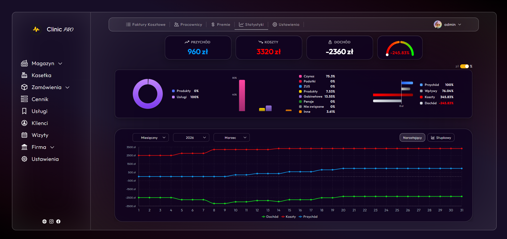
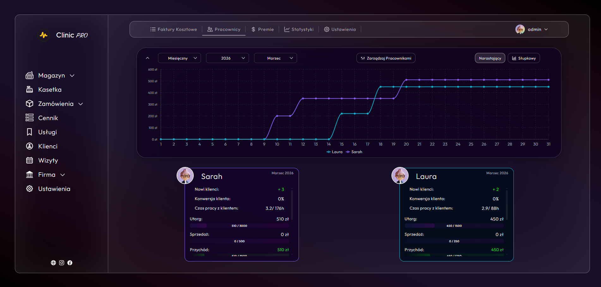
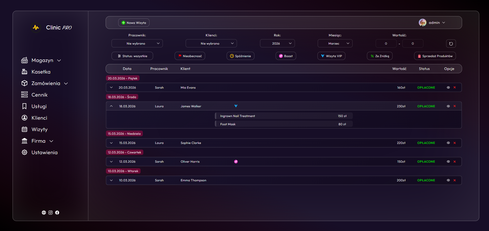
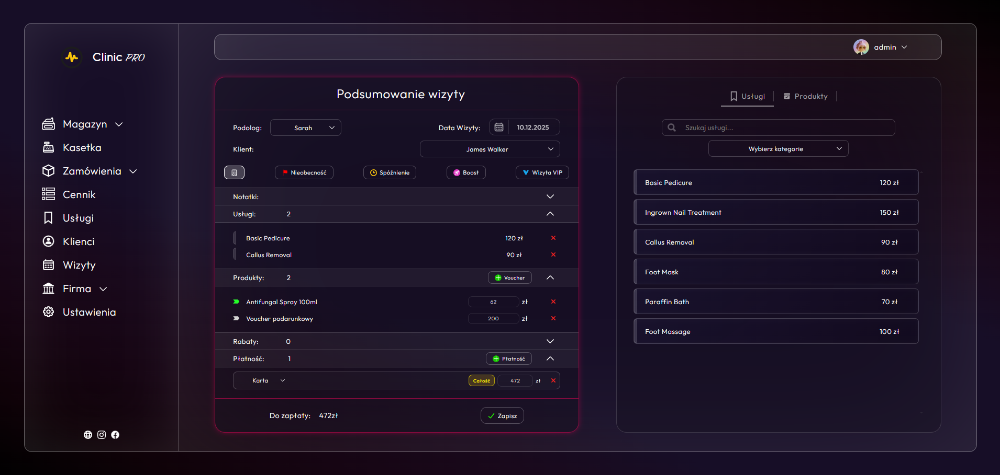
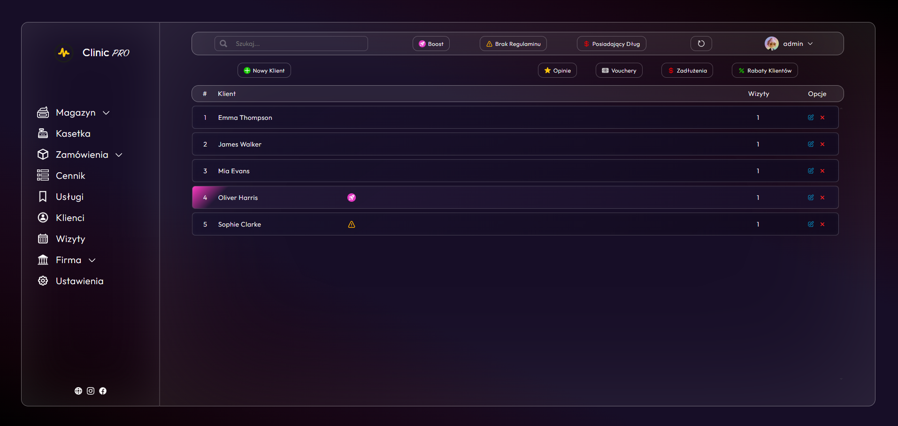
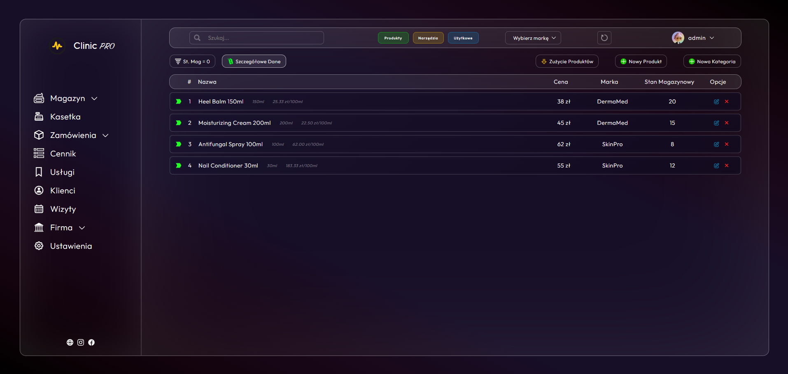

# ClinicManager

A full-stack clinic management system built for a podiatry clinic. Handles the full operational lifecycle - from supplier orders and inventory, through client visits and service billing, to owner-level financial reporting and employee performance tracking.

## Screenshots








## Features

- **Inventory & Orders** - place orders from suppliers, automatically update stock levels, generate PDF inventory reports, conduct stock audits
- **Client & Visit Management** - client profiles, visit scheduling, service pricing catalog, product consumption tracked per visit
- **Financial Dashboard** - revenue statistics, employee performance metrics, automated bonus calculation
- **Auth & Security** - JWT-based authentication, role-based access control (`ROLE_USER`, `ROLE_ADMIN`), rate limiting on login endpoints, token blacklisting via Redis, inactivity-based auto logout
- **Audit Logging** - all create/update/delete actions are logged with user context

## Tech Stack

**Backend**
- Java 21, Spring Boot 3.3.4
- Spring Security (JWT, stateless)
- Spring Data JPA + PostgreSQL
- Liquibase (schema migrations)
- Redis (token blacklist)
- OpenPDF (inventory reports)

**Frontend**
- React 18, TypeScript
- Custom utility CSS system
- Vite

**Infrastructure**
- Docker + Docker Compose
- Nginx (reverse proxy, HTTPS, rate limiting, security headers)
- Let's Encrypt (auto-renewed SSL via Certbot)
- GitHub Actions (CI - build & test on every push)

## Architecture

Layered Spring Boot architecture: `controller → service → repository → model`

- REST controllers under `/api/*` with `@PreAuthorize` role guards
- Search endpoints use `POST /search` with filter DTOs + pagination
- Soft-delete pattern - entities have `isDeleted` flag, no physical deletion
- DTO mapping via constructors and `toEntity()` - no MapStruct
- Global exception handling via `@RestControllerAdvice`

## Testing

Tests across unit, integration, and controller layers:
- **Service tests** - Mockito-based unit tests for all service implementations
- **Controller tests** - MockMvc + `@WebMvcTest` with Spring Security context
- **Repository tests** - `@DataJpaTest` with H2 in-memory database
- **Integration tests** - `@SpringBootTest` end-to-end flow tests

## First-time deployment

1. Install Docker.
2. Clone the repository.
3. Create a `.env` file in the project root:
   ```env
   POSTGRES_PASSWORD=your_strong_password
   JWT_SECRET=        # generate with: openssl rand -base64 64
   CORS_ALLOWED_ORIGINS=https://your-domain.com
   ```
4. Run the SSL initialization script (only once):
   ```bash
   chmod +x init-ssl.sh && ./init-ssl.sh
   ```
   This will:
   - Generate a Let's Encrypt SSL certificate via Certbot
   - Generate dhparam for stronger HTTPS encryption
   - Start all containers

5. Open `https://your-domain.com` and log in with default credentials: `admin` / `Admin123`. Change the password immediately.

## Updating the app

After pushing new code to the repository:
```bash
./update.sh
```

## Notes

- SSL certificates are renewed automatically by the Certbot container (checked every 12h).
- PostgreSQL is available on host port `5433` for database management tools (DBeaver, pgAdmin).
- CORS allowed origins are configured via `CORS_ALLOWED_ORIGINS` in `.env`.
- `init-ssl.sh` must be run before `update.sh` on a fresh server.
